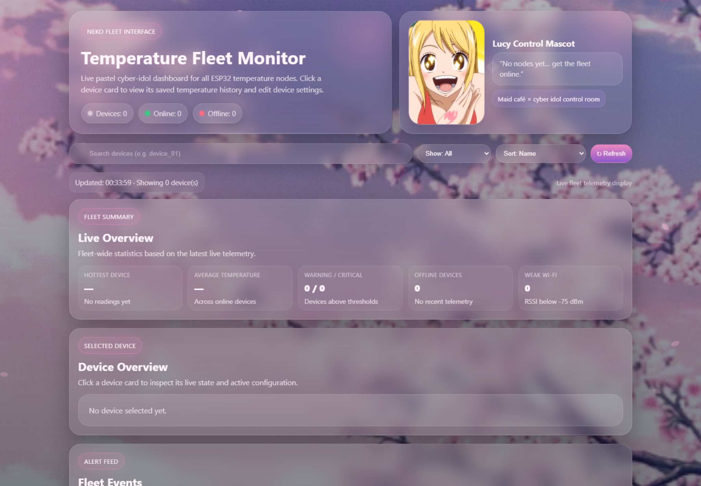
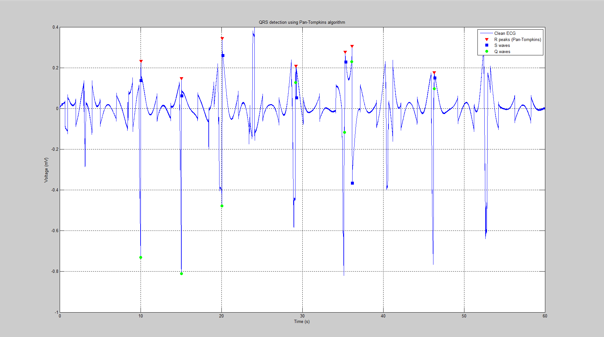
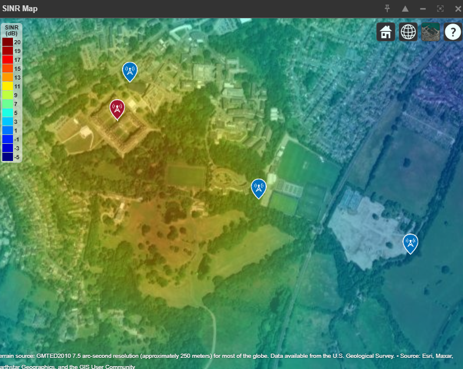

# Mohammad Zaid Aziz — Electronic Engineering Portfolio

Graduate Electronic Engineer based in London with a BEng Electronic Engineering (Upper Second-Class Honours, 69.5%) from Royal Holloway, University of London.

This repository contains the source for my engineering portfolio. It brings together university work across embedded systems, IoT, PCB design, FPGA/VHDL, digital signal processing, biomedical engineering, RF communications and electrical power systems.

## Featured work

### Temperature fleet-management platform

My final-year project combined embedded hardware, communications and full-stack software into a multi-node monitoring platform.

- ESP32-S3 nodes with LM35 analogue temperature sensing
- Device identity, temperature, RSSI and connection-health telemetry
- HTTP-to-MQTT bridge designed after direct MQTT port 1883 timed out on eduroam
- Node.js/Express backend with SQLite persistence and Socket.IO live updates
- Historical data, persistent event logs and remote device configuration
- Battery-powered stripboard prototype and a designed, printed and test-fitted enclosure

### FPGA digital systems

VHDL designs developed and verified on a Digilent Nexys A7-100T using AMD Vivado.

- Adders, counters, registers, multiplexers and a four-tap FIR filter
- Binary-to-BCD conversion and eight-digit multiplexed seven-segment display
- ADXL362 accelerometer integration over 1 MHz SPI
- 32-reading averaging, X/Y/Z axis selection and RGB orientation feedback
- Testbench, constraints and active-low display debugging

### ECG signal-analysis pipeline

Group coursework involving MATLAB processing of 60-second relaxed and post-exercise ECG recordings acquired with an OpenBCI Ganglion board at 200 Hz.

- Baseline-wander removal and noise filtering
- Q, R and S feature detection
- Pan-Tompkins-based QRS analysis
- Approximate manual heart-rate comparison: 72 BPM relaxed and 102 BPM post-exercise

### RF propagation and communications

MATLAB and Simulink investigations covering sinusoidal signals, FFT analysis, transmission lines, antennas, modulation and RF propagation.

- 868 MHz LoRa campus link modelling
- Free-space path loss and first Fresnel-zone analysis
- Coverage and SINR visualisation against -130 dBm receiver sensitivity
- Yagi-Uda, parabolic reflector, horn, helix, patch and Vivaldi antenna studies
- AM modulation/demodulation and 16-QAM through AWGN at 20, 10 and -10 dB SNR

### 100 kW online UPS conceptual design

A transformerless double-conversion UPS architecture modelled for a data-centre application.

- 400 V three-phase rectifier stage
- 480 V battery-supported DC link
- SPWM inverter and filtered 50 Hz output
- First-pass sizing: 144 A input, 208 A DC-link current and 34.7 Ah minimum battery capacity
- Reliability, bypass, redundancy and environmental considerations

### Digital signal processing

- Impulse-invariant IIR low-pass, band-stop and band-pass filters
- Frequency-sampling FIR filters using Hamming and Hann windows
- 512-point audio FFT analysis
- Practical notch and band-pass filtering

## Project files

Browse the [project folders](electronic-engineering-portfolio/) for the existing code, models and supporting material.

## Technical toolkit

| Area | Technologies |
| --- | --- |
| Embedded | ESP32-S3, Arduino, ADC, SPI, serial communication |
| Hardware | KiCad 9, analogue sensing, voltage regulation, PCB layout, stripboard prototyping |
| Digital design | VHDL, AMD Vivado, Nexys A7-100T, testbenches, timing and constraints |
| Software | MATLAB, Simulink, JavaScript, Node.js, Express, SQLite, Socket.IO, REST, WebSocket |
| Analysis | DSP, FFT, filter design, RF propagation, communications, control and power systems |

## Degree results

- BEng Electronic Engineering, Royal Holloway, University of London
- Upper Second-Class Honours (2:1)
- Final degree average: 69.5%
- Digital Systems Design: 86%
- Analogue Electronic Systems: 85%
- Signals, Systems & Communications: 75%
- Power Systems: 72%
- Digital Signal Processing Design: 71%
- Software Engineering for Electronics: 71%

## Portfolio site

The website source is in [`website/`](website/). Open [`website/index.html`](website/index.html) locally to view it, or visit the published portfolio:

[zaid-aziz-engineering-portfolio.mohammadzaid28072005.chatgpt.site](https://zaid-aziz-engineering-portfolio.mohammadzaid28072005.chatgpt.site)

