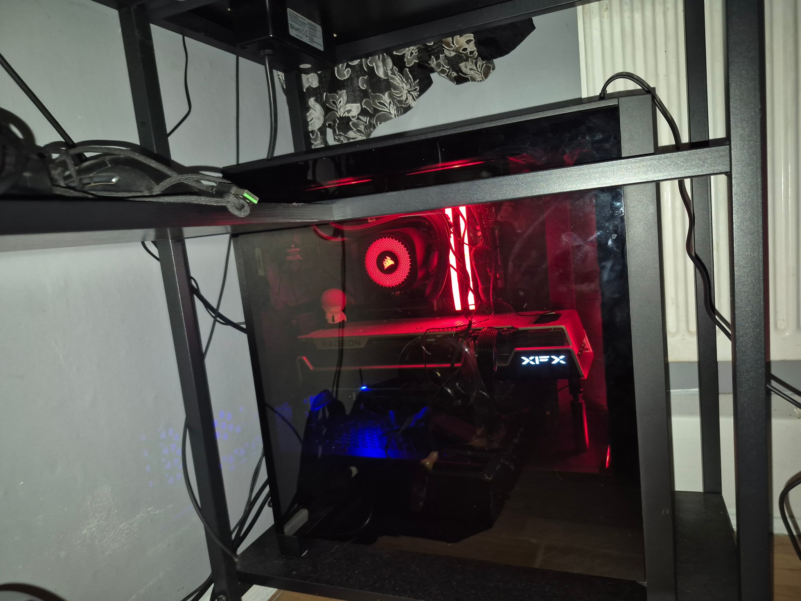
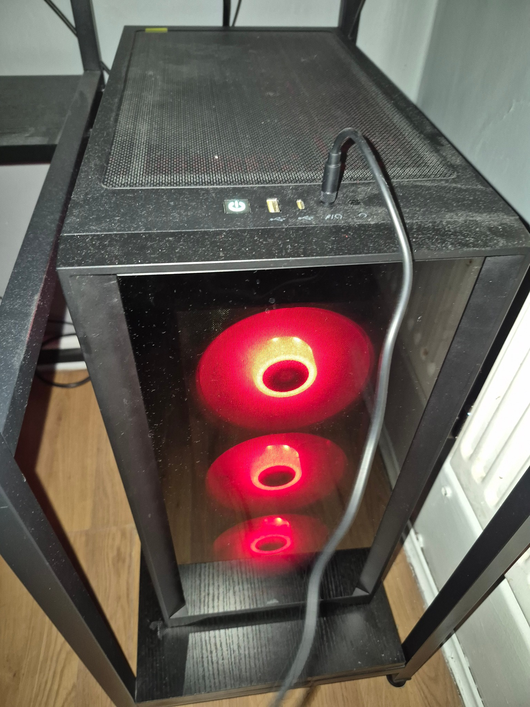
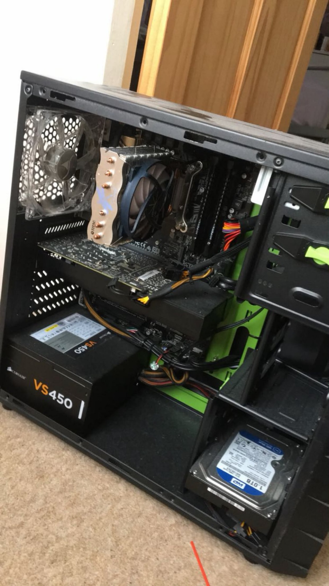

# PC Building, Upgrades and Optimisation

Personal hardware projects involving two desktop systems: my own PC and a rebuild into a friend's case.

## Red build — personal desktop

| Component | Specification |
| --- | --- |
| Processor | AMD Ryzen 7 9800X3D |
| Graphics | AMD Radeon RX 7900 XTX |
| Cooling upgrade | Air cooler replaced with an all-in-one (AIO) liquid cooler |
| Memory | 32 GB DDR5 |
| Storage | 3.5 TB total, expanded through additional storage upgrades |
| Motherboard | ASUS B650 |
| Fans | 4 |

I built this desktop and continue to upgrade and optimise it. Work includes replacing the air cooler with an AIO, installing additional storage, and regularly optimising the system as my requirements change.

## Green rebuild — case transfer for a friend

| Component | Specification |
| --- | --- |
| Processor | Intel Core i5 |
| Graphics | NVIDIA GeForce RTX 3050 |
| Memory | 16 GB DDR4 |
| Storage | 500 GB |
| Work | Component transfer, reassembly and system optimisation |

I transferred the existing RTX 3050 and Intel Core i5 system into my friend's case, reassembled the computer and optimised it.

## Practical experience

- Desktop assembly and component installation
- Transferring an existing system into another case
- CPU cooling replacement from air to AIO
- Storage expansion
- Ongoing system upgrades and optimisation

These personal projects complement my university electronics work with practical experience maintaining and upgrading complete computer systems.
